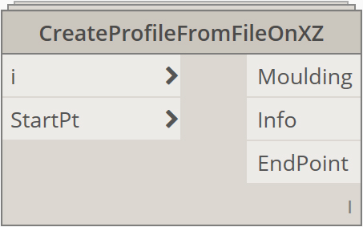

# 1.1. Functions

These are nodes developed to work with Excel Files. \(to read values from excel files it is necessary use nodes of Bumblebee Dynamo Package and follow instructions available at [BumbleBee Primer Project](https://konradsobon.gitbooks.io/bumblebee-primer/content/)\)

#### 1.1.1. Create Profile from File on XY

|  |  |
| --- | --- |
| _Node Image                                                                          ** **                                                                                                                                 _ | _Node Icon_                                                                                                                                                                                                                                                                                                                                                                                                                                                                               |

1. **Name** - Create Profile From File on XY
2. **\[ i \]** - INPUT - List of values from Excel File
3. **\[StartPt\]** - INPUT - Point By Coordinates
4. **\[EndPoint\]** - OUTPUT - Point By Coordinates
5. **\[Info\]** - OUTPUT - set of informations useful for managing Revit Families Parameters
6. **\[Moulding\]** - OUTPUT - geometry as a list of Curves or Polycurves

** 1.1.2. Create Profile from File on XZ**

|  |  |
| --- | --- |
| _Node Image                                                                          ** **                                                                                                                                 _ | _Node Icon_                                                                                                                                                                                                                                                                                                                                                                                                                                                                               |

1. **Name** - Create Profile From File on XZ
2. **\[ i \]** - INPUT - List of values from Excel File
3. **\[StartPt\]** - INPUT - Point By Coordinates
4. **\[EndPoint\]** - OUTPUT - Point By Coordinates
5. **\[Info\]** - OUTPUT - set of informations useful for managing Revit Families Parameters
6. **\[Moulding\]** - OUTPUT - geometry as a list of Curves or Polycurves

