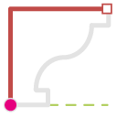

# 1.2. Profiles and Paths

### 1.2.1. Close Profile {#1.1.1.-create-profile-from-excel-file}

These are nodes developed to work with Excel Files. \(to read values from excel files it is necessary use nodes of Bumblebee Dynamo Package and follow instructions available at [BumbleBee Primer Project](https://konradsobon.gitbooks.io/bumblebee-primer/content/)\)

#### 1.2.1.1. Close Profile \( - \) {#1.1.1.1.-create-profile-from-file-on-xy}

|  |  |
| --- | --- |
| _Node Image_ | _Node Icon _ |

1. **Name** - Create Profile From File on XY
2. **\[ StartPt \]** - INPUT - List of values from Excel File
3. **\[EndPt\]** - INPUT - Point By Coordinates
4. **\[Moulding\]** - INPUT - Point By Coordinates
5. **\[Profile\]** - OUTPUT - set of informations useful for managing Revit Families Parameters
6. **\[Same sequence\]** - OUTPUT - geometry as a list of Curves or Polycurves

**1.2.1.1. Close Profile \( + \)**

|  |  |
| --- | --- |
| _Node Image_ |  _Node Icon_ |

1. **Name** - Create Profile From File on XY
2. **\[ StartPt \]** - INPUT - List of values from Excel File
3. **\[EndPt\]** - INPUT - Point By Coordinates
4. **\[Moulding\]** - INPUT - Point By Coordinates
5. **\[Profile\]** - OUTPUT - set of informations useful for managing Revit Families Parameters
6. **\[Same sequence\]** - OUTPUT - geometry as a list of Curves or Polycurves

**1.2.1.3. Close Profile for sequence**

|  |  |
| --- | --- |
| _Node Image_  |  _Node Icon_ |

1. **Name** - Create Profile From File on XY
2. **\[ StartPt \]** - INPUT - List of values from Excel File
3. **\[EndPt\]** - INPUT - Point By Coordinates
4. **\[Moulding\]** - INPUT - Point By Coordinates
5. **\[Profile\]** - OUTPUT - set of informations useful for managing Revit Families Parameters
6. **\[Same sequence\]** - OUTPUT - geometry as a list of Curves or Polycurves

**1.2.1.4. Close Profile with offset**

|  |  |
| --- | --- |
| _Node Image_ |  _Node Icon_ |

1. **Name** - Create Profile From File on XY
2. **\[ StartPt \]** - INPUT - List of values from Excel File
3. **\[EndPt\]** - INPUT - Point By Coordinates
4. **\[Moulding\]** - INPUT - Point By Coordinates
5. **\[Profile\]** - OUTPUT - set of informations useful for managing Revit Families Parameters
6. **\[Same sequence\]** - OUTPUT - geometry as a list of Curves or Polycurves

### 1.2.2. Offset {#1.1.1.-create-profile-from-excel-file}

These are nodes developed to work with Excel Files.

**1.2.2.1. Offset from Start point and End point**

|  |  |
| --- | --- |
| _Node Image_ |  _Node Icon_ |

1. **Name** - Create Profile From File on XY
2. **\[ StartPt \]** - INPUT - List of values from Excel File
3. **\[EndPt\]** - INPUT - Point By Coordinates
4. **\[Moulding\]** - INPUT - Point By Coordinates
5. **\[Profile\]** - OUTPUT - set of informations useful for managing Revit Families Parameters
6. **\[Same sequence\]** - OUTPUT - geometry as a list of Curves or Polycurves

