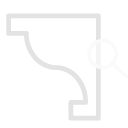

# 1.3. Revit

The node is able to set a parameter value from Revit Family using the Parameter Name

#### 1.3.1. Set Parameter Value {#1.2.1.1.-close-profile-(-)}

| ​ |  |
| --- | --- |
| _Node Image_ | _Node Icon_ |

1. **Name** - Create Profile From File on XY
2. **\[ StartPt \]** - INPUT - List of values from Excel File
3. **\[EndPt\]** - INPUT - Point By Coordinates
4. **\[Moulding\]** - INPUT - Point By Coordinates
5. **\[Profile\]** - OUTPUT - set of informations useful for managing Revit Families Parameters
6. **\[Same sequence\]** - OUTPUT - geometry as a list of Curves or Polycurves

