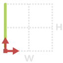
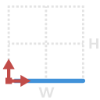
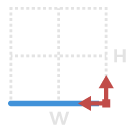

# 1.5.1. Geometry\_01

The output of a node is a line between two point

#### 1.5.1.1. 1a {#1.2.1.1.-close-profile-(-)}

| ​ |  |  |
| --- | --- |
| _Node Image_ | _Node Icon_ |  |

1. **Name** - 1a
2. **\[ StartPt \]** - INPUT -  Point By Coordinates \| _Default Value {0, 0, 0}_
3. **\[ HW\]** - INPUT - Height and Width as a list {H,W} \| _Default Value {10,10}_
4. **\[ EndPt \]** - OUPUT - Point By Coordinates
5. **\[ 1a \]** - OUTPUT - geometry as a list of Curves or Polycurves

#### 1.5.1.2. 1b

| ​ |  |  |
| --- | --- |
| _Node Image_ | _Node Icon_ |  |

1. **Name** - 1b
2. **\[ StartPt \]** - INPUT -  Point By Coordinates \| _Default Value {0, 0, 0}_
3. **\[ HW\]** - INPUT - Height and Width as a list {H,W} \| _Default Value {10,10}_
4. **\[ EndPt \]** - OUPUT - Point By Coordinates
5. **\[ 1b \]** - OUTPUT - geometry as a list of Curves or Polycurves

#### 1.5.1.3. 1c {#1.2.1.1.-close-profile-(-)}

| ​ |  |  |
| --- | --- |
| _Node Image_ | _Node Icon_ |  |

1. **Name** - 1c
2. **\[ StartPt \]** - INPUT -  Point By Coordinates \| _Default Value {0, 0, 0}_
3. **\[ HW\]** - INPUT - Height and Width as a list {H,W} \| _Default Value {10,10}_
4. **\[ EndPt \]** - OUPUT - Point By Coordinates
5. **\[ 1c \]** - OUTPUT - geometry as a list of Curves or Polycurves

