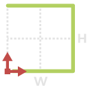
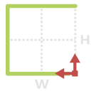

# 1.5.3. Geometry\_03

#### 1.5.3.1. 3a {#1.2.1.1.-close-profile-(-)}

| ​ |  |  |
| --- | --- |
| _Node Image_ | _Node Icon_ |  |

1. **Name** - 3a
2. **\[ StartPt \]** - INPUT -  Point By Coordinates \| _Default Value {0, 0, 0}_
3. **\[ HW\]** - INPUT - Height and Width as a list {H,W} \| _Default Value {10,10}_
4. **\[ EndPt \]** - OUPUT - Point By Coordinates
5. **\[ 3a \]** - OUTPUT - geometry as a list of Curves or Polycurves

#### 1.5.3.2. 3b

| ​ |  |  |
| --- | --- |
| _Node Image_ | _Node Icon_ |  |

1. **Name** - 3b
2. **\[ StartPt \]** - INPUT -  Point By Coordinates \| _Default Value {0, 0, 0}_
3. **\[ HW\]** - INPUT - Height and Width as a list {H,W} \| _Default Value {10,10}_
4. **\[ EndPt \]** - OUPUT - Point By Coordinates
5. **\[ 3b \]** - OUTPUT - geometry as a list of Curves or Polycurves

#### 1.5.3.3. 3c {#1.2.1.1.-close-profile-(-)}

| ​ |  |  |
| --- | --- |
| _Node Image_ | _Node Icon_ |  |

1. **Name** - 3c
2. **\[ StartPt \]** - INPUT -  Point By Coordinates \| _Default Value {0, 0, 0}_
3. **\[ HW\]** - INPUT - Height and Width as a list {H,W} \| _Default Value {10,10}_
4. **\[ EndPt \]** - OUPUT - Point By Coordinates
5. **\[ 3c \]** - OUTPUT - geometry as a list of Curves or Polycurves

#### 1.5.3.4. 3d {#1.2.1.1.-close-profile-(-)}

| ​ |  |  |
| --- | --- |
| _Node Image_ | _Node Icon_ |  |

1. **Name** - 3d
2. **\[ StartPt \]** - INPUT -  Point By Coordinates \| _Default Value {0, 0, 0}_
3. **\[ HW\]** - INPUT - Height and Width as a list {H,W} \| _Default Value {10,10}_
4. **\[ EndPt \]** - OUPUT - Point By Coordinates
5. **\[ 3d \]** - OUTPUT - geometry as a list of Curves or Polycurves

