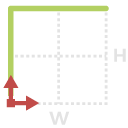
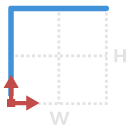
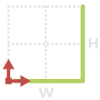
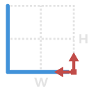

# 1.5.2. Geometry\_02

#### 1.5.2.1. 2a {#1.5.2.1.-2a}

| ​ |  |  |
| --- | --- |
| _Node Image_ | _Node Icon_ |  |

1. **Name** - 2a
2. **\[ StartPt \]** - INPUT - Point By Coordinates \| _Default Value {0, 0, 0}_
3. **\[ HW\]** - INPUT - Height and Width as a list {H,W} \| _Default Value {10,10}_
4. **\[ EndPt \]** - OUPUT - Point By Coordinates
5. **\[ 2a \]** - OUTPUT - geometry as a list of Curves or Polycurves

#### 1.5.2.2. 2b {#1.5.2.2.-2b}

| ​ |  |  |
| --- | --- |
| _Node Image_ |  Node Icon |  |

1. **Name** - 2b
2. **\[ StartPt \]** - INPUT - Point By Coordinates \| _Default Value {0, 0, 0}_
3. **\[ HW\]** - INPUT - Height and Width as a list {H,W} \| _Default Value {10,10}_
4. **\[ EndPt \]** - OUPUT - Point By Coordinates
5. **\[ 2b \]** - OUTPUT - geometry as a list of Curves or Polycurves

#### 1.5.2.3. 2c {#1.5.2.3.-2c}

| ​ |  |  |
| --- | --- |
| _Node Image_ | _Node Icon_ |  |

1. **Name** - 2c
2. **\[ StartPt \]** - INPUT - Point By Coordinates \| _Default Value {0, 0, 0}_
3. **\[ HW\]** - INPUT - Height and Width as a list {H,W} \| _Default Value {10,10}_
4. **\[ EndPt \]** - OUPUT - Point By Coordinates
5. **\[ 2c \]** - OUTPUT - geometry as a list of Curves or Polycurves

#### 1.5.2.4. 2d {#1.5.2.4.-2d}

| ​ |  |  |
| --- | --- |
| _Node Image_ | _Node Icon_ |  |

1. **Name** - 2d
2. **\[ StartPt \]** - INPUT - Point By Coordinates \| _Default Value {0, 0, 0}_
3. **\[ HW\]** - INPUT - Height and Width as a list {H,W} \| _Default Value {10,10}_
4. **\[ EndPt \]** - OUPUT - Point By Coordinates
5. **\[ 2d \]** - OUTPUT - geometry as a list of Curves or Polycurves

